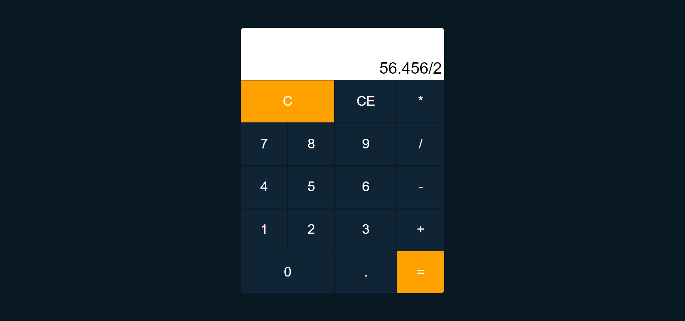

<h1 align="center">Calculadora JavaScript</h1>
<h1 align="center"></h1>

### 📚 Sobre

Calculadora feita para fixação do conteúdo sobre funções construtoras no Javascript.

### 🎨 Detalhe

Foram feitas algumas estilizações dentro do projeto.

### 💻 Tecnologias utilizadas

Nesta calculadora foi utilizadas as seguintes tecnologias:

- HTML
- CSS
- JavaScript
- Figma para criação do Layout

### :airplane: Acesse o projeto

Hospedado no Netlify

https://calculadora-javascript-2021.netlify.app/
